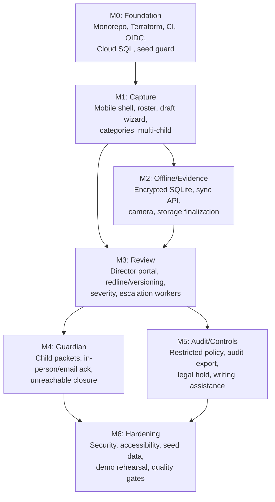

# Incident Ledger — Full Implementation Plan

## Overview

Incident Ledger is a synthetic-data-only demo of a child-care incident reporting system with three clients (staff iOS/iPad app, director browser portal, guardian one-time web view) backed by a FastAPI/PostgreSQL API, Cloud Run workers, and Google Cloud infrastructure. This plan synthesizes all twelve specification documents into an actionable, phased build order.

> [!IMPORTANT]
> This is a **Demo Center Release** only. All data must be synthetic (`synthetic_marker=true`), one allowlisted center, mail-capture recipient allowlist, and `DEMO_ONLY=true` compile guard. No real people, children, incidents, or contact information.

---

## Technology Stack

| Layer | Technology | Notes |
|---|---|---|
| Staff mobile | Expo (React Native) + TypeScript | iOS/iPadOS only; native modules for Keychain, encrypted SQLite, camera, background tasks, network state |
| Director portal | Expo Web + TypeScript | Browser-based, shared components with mobile; responsive with iPad side-by-side review |
| Guardian web | Expo Web + TypeScript | Small responsive app, shared design system; opaque one-time token flow |
| Navigation | Expo Router (file-based) | All apps use Expo Router |
| API | FastAPI + Pydantic + SQLAlchemy + Alembic | Deployed to Cloud Run; Python 3.14 |
| Workers | Cloud Run service/job | Consumes Cloud Tasks for notifications, escalation, token expiry, audit export, sync exception processing |
| Database | Cloud SQL PostgreSQL | System of record |
| Binary storage | Google Cloud Storage | Staging bucket + retention-protected evidence bucket + audit-packet bucket |
| Dependency mgmt | UV + pyproject.toml | Python side |
| Identity | Microsoft Entra (OIDC) | JWT validation, map external subject to synthetic user |
| Email (demo) | Console/DB logging | No actual email sending; log to console + `notification_deliveries` table |
| Writing assistance | Gemini 2.5 Flash via Vertex AI | Bounded writing suggestions; existing GCP project |
| Observability | Cloud Logging/Monitoring/Error Reporting | Structured JSON logs, correlation IDs |
| Infrastructure | Terraform + GitHub Actions + Secret Manager + Artifact Registry | IaC for all environments |

---

## Resolved Design Decisions

| Decision | Choice | Rationale |
|---|---|---|
| **UI framework** | Expo Web for all three clients (mobile, director, guardian) | Single monorepo, shared components and design system |
| **Navigation** | Expo Router (file-based) | Recommended by Expo, convention-based |
| **OIDC provider** | Microsoft Entra | User's existing identity provider |
| **Email (demo)** | Console/DB logging only | No actual email sending; log to `notification_deliveries` table + console output |
| **Writing assistance** | Gemini 2.5 Flash via Vertex AI | User has existing GCP project with access |
| **Repo structure** | Single monorepo with workspaces | `services/api/`, `apps/mobile/`, `apps/director/`, `apps/guardian/`, `infra/` |
| **GCP project** | Existing project (user will provide ID) | Terraform will provision resources within it |

## Remaining Open Questions

1. **State management (clients)**: Zustand, Jotai, or Redux Toolkit for the Expo apps?
2. **Testing framework (API)**: pytest with httpx `TestClient` for FastAPI integration tests?
3. **Testing framework (mobile)**: Jest + React Native Testing Library + Detox for E2E?
4. **Domain/SSL**: Is there a domain for the demo, or should we use Cloud Run default URLs?
5. **GCP Project ID**: Please provide when ready (needed for Terraform and Vertex AI configuration).
6. **Microsoft Entra tenant**: Please provide tenant ID and app registration details when ready.

---

## Proposed Changes

### Milestone 0 — Foundation

Goal: Monorepo skeleton, infrastructure-as-code, CI pipeline, OIDC integration, database with seed guard, and dev smoke test.

---

#### [NEW] Monorepo Root

| File | Purpose |
|---|---|
| `Makefile` | Top-level commands: `seed-demo`, `reset-demo`, `verify-demo-data`, `dev`, `test`, `lint` |
| `pyproject.toml` | Python workspace root (UV) |
| `.github/workflows/ci.yml` | PR checks: format, lint, typecheck, dependency scan, unit tests, API contract compat, migration validation, synthetic-data scan |
| `.github/workflows/deploy.yml` | Main → build images → deploy dev → integration/E2E smoke |
| `.github/workflows/release.yml` | RC → deploy demo → seed → full E2E/security suite |

#### [NEW] `infra/` — Terraform Modules

Per [infra-and-operations.md](file:///Users/krishnajammula/Development/incident-ledger/docs/infra-and-operations.md):

| Module | Resources |
|---|---|
| `infra/modules/network/` | VPC, private service networking, VPC connectors |
| `infra/modules/cloudsql/` | PostgreSQL instance, backups, PITR, least-privilege DB users |
| `infra/modules/storage/` | 3 buckets (staging, finalized evidence, audit-packet), private IAM, lifecycle/retention policies |
| `infra/modules/run/` | Cloud Run services (API, worker, guardian-web, director-portal), service accounts, env config |
| `infra/modules/tasks/` | Cloud Tasks queues, retry policy, dead-letter routing |
| `infra/modules/secrets/` | Secret Manager references for OIDC, email, Gemini keys |
| `infra/modules/monitoring/` | Uptime checks, worker backlog alerts, sync exception alerts, error-rate alerts, new-device alerts |
| `infra/envs/dev/` | Dev environment tfvars |
| `infra/envs/demo/` | Demo environment tfvars with `DEMO_ONLY=true` |

#### [NEW] `services/api/` — FastAPI Application Skeleton

Per [architecture.md](file:///Users/krishnajammula/Development/incident-ledger/docs/architecture.md#L38-L47):

```
services/api/
├── pyproject.toml          # Python deps (FastAPI, Pydantic, SQLAlchemy, Alembic, etc.)
├── alembic/                # Migration framework
│   └── versions/           # Individual migrations
├── app/
│   ├── main.py             # FastAPI app factory, middleware, CORS, error handlers
│   ├── config.py           # Settings from env/Secret Manager; DEMO_ONLY guard
│   ├── api/                # Routers + request/response Pydantic models
│   │   ├── auth.py         # /me, /auth/session/switch, /devices/register
│   │   ├── incidents.py    # CRUD, draft, submit, sync-operations
│   │   ├── evidence.py     # intents, finalize
│   │   ├── review.py       # acknowledge, edits, request-changes, severity, approve
│   │   ├── guardian.py     # packets, email-links, acknowledgements
│   │   ├── addenda.py      # addendum flow
│   │   ├── audit.py        # audit-packet export
│   │   ├── writing.py      # writing-assistance suggestions
│   │   ├── operations.py   # health dashboard
│   │   └── deps.py         # FastAPI dependencies (DB session, current user, etc.)
│   ├── domain/             # Pure business rules, state machine, enums
│   │   ├── enums.py        # UserRole, IncidentStatus, SeverityLevel, etc.
│   │   ├── state_machine.py # Report status transitions (command-based)
│   │   ├── policies.py     # Photo policy, restricted policy, escalation rules, contact attempt rules
│   │   └── rules.py        # Required fields, severity escalation, unreachable closure (3 attempts/2 dates)
│   ├── repositories/       # SQLAlchemy persistence
│   │   ├── incidents.py
│   │   ├── report_versions.py
│   │   ├── evidence.py
│   │   ├── guardian_packets.py
│   │   ├── users.py
│   │   └── audit.py
│   ├── services/           # Use cases and policy enforcement
│   │   ├── incident_service.py
│   │   ├── review_service.py
│   │   ├── guardian_service.py
│   │   ├── evidence_service.py
│   │   ├── sync_service.py
│   │   └── writing_service.py
│   ├── integrations/       # External service adapters
│   │   ├── oidc.py         # JWT validation, subject → user mapping
│   │   ├── storage.py      # GCS signed upload intents, object verification
│   │   ├── email.py        # Email provider adapter (mail-capture in demo)
│   │   ├── gemini.py       # Bounded writing assistance adapter
│   │   └── task_queue.py   # Cloud Tasks enqueue
│   ├── workers/            # Task handlers
│   │   ├── director_alert.py
│   │   ├── escalation.py   # 30-min backup, 60-min regional
│   │   ├── guardian_email.py
│   │   ├── token_expiry.py
│   │   ├── sync_exception.py
│   │   ├── audit_export.py
│   │   └── retention.py
│   ├── audit/              # Append-only audit writer and export builder
│   │   ├── writer.py       # Audit event creation (all material actions)
│   │   └── exporter.py     # Audit packet assembly
│   └── models/             # SQLAlchemy ORM models
│       ├── base.py
│       ├── centers.py
│       ├── users.py
│       ├── devices.py
│       ├── children.py
│       ├── guardians.py
│       ├── incidents.py
│       ├── report_versions.py
│       ├── evidence.py
│       ├── guardian_packets.py
│       ├── acknowledgements.py
│       ├── contact_attempts.py
│       ├── sync_operations.py
│       ├── audit_events.py
│       └── outbox.py       # Transactional outbox for domain events
└── tests/
    ├── unit/               # Pure domain rule tests
    ├── integration/        # FastAPI TestClient + real Postgres
    └── conftest.py
```

#### [NEW] Initial Alembic Migration

Implements the full schema from [db-schema.md](file:///Users/krishnajammula/Development/incident-ledger/docs/db-schema.md):

- All 13 core tables: `centers`, `users`, `devices`, `children`, `guardians`, `child_guardians`, `incidents`, `incident_children`, `report_versions`, `evidence_items`, `guardian_packets`, `acknowledgements`, `contact_attempts`, `sync_operations`, `audit_events`
- Additional tables from schema §Additional: `category_responses`, `review_actions`, `email_link_tokens` (token hash only), `notification_deliveries`, `outbox_events`, `legal_holds`, `retention_disposals`, `assistant_interactions`, `report_views`
- Custom enums: `user_role`, `incident_status`, `severity_level`
- All UUIDs are UUIDv7, application-generated
- All timestamps are `timestamptz` in UTC
- All business tables scoped by `center_id`
- Immutable triggers on: `report_versions`, `acknowledgements`, `contact_attempts`, `audit_events`
- Indexes: `idx_incidents_queue`, `idx_audit_incident_time`, `idx_contact_attempts`

#### [NEW] OIDC + Session Bootstrap

- `POST /auth/session/switch`: end prior active session, begin named user session
- `GET /me`: returns active user, role, center, device status
- `POST /devices/register`: register device, enforce per-center `max_active_mobile_installations` and per-user limit
- Map approved OIDC subjects to pre-seeded synthetic users only
- No self-registration; render no content before valid session

#### Completion Evidence
- `make dev` starts API locally
- `make migrate` runs all Alembic migrations against local Postgres
- Sign in via OIDC → `/me` returns seeded user
- Terraform `plan` succeeds for dev environment

---

### Milestone 1 — Incident Capture

Goal: Mobile app shell, active-user display, roster, draft wizard with category schemas, multi-child draft.

---

#### [NEW] `apps/mobile/` — Expo Mobile App

```
apps/mobile/
├── app.json / app.config.ts   # Expo config (iOS/iPadOS only for demo)
├── src/
│   ├── navigation/            # Stack/tab navigation
│   ├── screens/
│   │   ├── SignInScreen.tsx
│   │   ├── IncidentListScreen.tsx
│   │   ├── DraftWizardScreen.tsx    # Multi-step form
│   │   └── IncidentDetailScreen.tsx
│   ├── components/
│   │   ├── ActiveUserBar.tsx        # Persistent display name + role bar
│   │   ├── OfflineBanner.tsx        # Network status banner
│   │   ├── CategoryPicker.tsx
│   │   ├── SeverityPicker.tsx
│   │   ├── ChildSelector.tsx        # Multi-child, primary affected designation
│   │   ├── LocationInput.tsx
│   │   ├── WitnessSection.tsx
│   │   ├── FactualNotesEditor.tsx
│   │   └── DraftStatusIndicator.tsx # Saving locally / Saved / Syncing / Synced / Needs attention
│   ├── api/                   # Generated TypeScript client from OpenAPI
│   ├── store/                 # Local state management
│   ├── db/                    # Encrypted SQLite (expo-sqlite + iOS Keychain)
│   └── utils/
│       ├── uuidv7.ts
│       └── network.ts         # Reachability monitoring
```

#### Key Behaviors (from [product-scope.md](file:///Users/krishnajammula/Development/incident-ledger/docs/product-scope.md))

- **Required fields** (enforced client-side for UX, server-side for truth): ≥1 child, category, severity, event date/time, exact-or-estimated flag, location, factual description, actions taken, staff accuracy confirmation
- **Witnesses**: capture staff present/witnesses OR explicit no-known-witnesses confirmation
- **Multi-child**: a report can involve multiple children; primary affected child is distinct from involved/witness
- **Categories**: Injury/accident, Illness/medical, Behavioral, Suspected abuse/neglect, Missing child/unauthorized pickup, Medication error, Property damage, Other
- **Severity**: Low, Moderate, High, Critical (with workflow escalation effects)
- **Active user bar**: visible throughout capture, evidence, review, submission
- **Staff handoff**: different authorized staff may continue a draft; creator/editor/submitter attribution preserved
- **Treatment/response**: captured when applicable
- **Guardian contact outcome**: captured during submission flow

#### [NEW] API Endpoints (M1)

Per [api-contracts.md](file:///Users/krishnajammula/Development/incident-ledger/docs/api-contracts.md):

| Endpoint | Implementation |
|---|---|
| `GET /v1/incidents` | List eligible reports for current user/center |
| `POST /v1/incidents` | Create draft (command-based, not CRUD) |
| `GET /v1/incidents/{id}` | Report detail with version history |
| `PATCH /v1/incidents/{id}/draft` | Optimistic draft update with `If-Match` ETag |
| `POST /v1/incidents/{id}/submit` | Server submission receipt with staff attestation |

#### [NEW] Domain Layer (M1)

- Pydantic models for all request/response types
- State machine: `Draft → Submitted` transition with required-field validation
- Category-specific required field rules
- Policy: restricted category detection (suspected abuse/neglect)
- OpenAPI schema generation → TypeScript client codegen

#### Completion Evidence
- Create and resume a multi-child draft on iOS simulator
- Required-field omission returns field-specific 422
- Active user bar visible throughout wizard
- Staff handoff: Staff A creates, Staff B continues; attribution preserved

---

### Milestone 2 — Offline Sync & Evidence

Goal: Encrypted SQLite operation queue, sync API, camera capture flow, evidence storage finalization, airplane-mode submit with exactly-once sync.

---

#### [NEW] Local Persistence (from [mobile-offline-sync.md](file:///Users/krishnajammula/Development/incident-ledger/docs/mobile-offline-sync.md))

Local encrypted SQLite tables:
- `local_incidents`: draft/report snapshot, local status, server version ETag
- `local_operations`: immutable operation ID, entity ID, type, payload, payload hash, retry count, state
- `local_evidence`: capture metadata, local file path, checksum, upload state
- `cached_roster`: center-scoped synthetic child/guardian display data, refresh timestamp
- `session`: active user and device registration state

Encryption key in iOS Keychain, unavailable until device unlock.

#### [NEW] Sync Engine

Operation protocol:
1. Generate UUIDv7 `operation_id` → `Idempotency-Key` header
2. Commit local entity mutation + operation record in one SQLite transaction
3. Display local status immediately; never claim server receipt without API response
4. On connectivity: process in dependency order: `create → patch → evidence intent/upload/finalize → submit`
5. Server stores `(device_id, idempotency_key, payload_sha256)` → returns prior result for exact retry
6. Same key + different hash → `409 IDEMPOTENCY_PAYLOAD_MISMATCH`
7. Retry with capped exponential backoff + jitter; no auto-retry on validation/policy errors

Conflict policy:
- Draft changes use `If-Match` ETag
- Concurrent staff edits → field-level conflict screen → explicit user resolution
- Post-submission records → state error → direct to change-request/addendum flow
- Evidence finalization idempotent by evidence ID + SHA-256

#### [NEW] Sync API Endpoint

| Endpoint | Purpose |
|---|---|
| `POST /v1/incidents/{id}/sync-operations` | Idempotent offline operation batch |

#### [NEW] Evidence Capture & Finalization

Per [security-privacy.md](file:///Users/krishnajammula/Development/incident-ledger/docs/security-privacy.md#L23-L26):

- **Camera-only**: no library/document/audio/video picker dependencies
- **Policy checks**: category-policy AND center-policy permission required; max 5 images/report; max 10 MB/image
- **Flow**: `POST /v1/incidents/{id}/evidence/intents` → validate policy → signed upload intent → client uploads to GCS staging → `POST /v1/incidents/{id}/evidence/{evidenceId}/finalize` → verify SHA-256 + capturer/device/time → move to retention-protected bucket
- **Supported types**: `image/jpeg`, `image/heic`
- **No replacement** after approval

#### [NEW] Connectivity UX

- Persistent offline banner when network unavailable
- Draft autosave indicator: `Saving locally` → `Saved locally` → `Syncing` → `Synced` → `Needs attention`
- Offline submission: exactly `Submitted—pending secure sync`
- 72-hour unsynced alert: local high-priority issue + operations API notification on reconnect
- Disable staff switch while offline (identity change requires server confirmation)
- Background: iOS background task scheduling (opportunistic, no promise of immediate sync)
- Preserve pending operations across app termination and device restart

#### Completion Evidence
- Airplane-mode submit → app restart → duplicate retry → reconnect → exactly one server incident
- 5-image and 10 MB enforcement; gallery/document/video/audio route absent
- Evidence upload interrupted → retry → finalized with matching SHA-256
- `Submitted—pending secure sync` displayed correctly until server receipt

---

### Milestone 3 — Director Review

Goal: Director portal, redline/versioning, severity changes, escalation workers, High/Critical timeline.

---

#### [NEW] `apps/director/` — Director Portal (Expo Web or standalone React)

```
apps/director/
├── src/
│   ├── pages/
│   │   ├── ReviewQueuePage.tsx      # Queue with elapsed time, escalation indicators
│   │   ├── IncidentReviewPage.tsx   # Source vs. edited narrative, redline view
│   │   └── AuditPacketPage.tsx
│   ├── components/
│   │   ├── ActiveUserBar.tsx
│   │   ├── RedlineViewer.tsx        # Side-by-side original vs. director edit
│   │   ├── SeverityChangeBanner.tsx
│   │   ├── EscalationTimeline.tsx   # 30-min backup, 60-min regional
│   │   └── VersionHistory.tsx
│   └── api/                         # Same generated TypeScript client
```

#### [NEW] Review API Endpoints (M3)

| Endpoint | Purpose |
|---|---|
| `GET /v1/review-queue` | Queue with escalation state and elapsed time |
| `POST /v1/incidents/{id}/review/acknowledge` | Director claims ownership |
| `POST /v1/incidents/{id}/review/edits` | Minor wording edit with mandatory reason; creates new `director_edit` version |
| `POST /v1/incidents/{id}/review/request-changes` | Return report to staff for factual clarification |
| `POST /v1/incidents/{id}/review/severity` | Change severity with reason; preserve staff-selected severity |
| `POST /v1/incidents/{id}/review/approve` | Freeze version → start guardian notification where permitted |

#### [NEW] Review Domain Rules

- Director minor edits: grammar, spelling, formatting, neutrality, clarity ONLY
- Factual changes: require staff changes or addendum (not director edit)
- Edit without reason → rejection
- Approval freezes version; any later correction is an addendum
- `original_staff_notes` always preserved verbatim
- Version model: `staff_submission` → `director_edit` → `approved` (each a new `report_versions` row)
- Redline: `director_edit` version includes mandatory `edit_reason` and diff against parent version

#### [NEW] Escalation Workers

Per [infra-and-operations.md](file:///Users/krishnajammula/Development/incident-ledger/docs/infra-and-operations.md#L14-L22):

| Worker | Trigger | Idempotency |
|---|---|---|
| Director alert | High/Critical submission | `incident + submitted version` |
| Backup escalation | 30 minutes unacknowledged | `incident + escalation stage` |
| Regional escalation | 60 minutes unacknowledged | `incident + escalation stage` |

All workers use Cloud Tasks with task names derived from event IDs for deduplication. Workers consume from transactional outbox.

#### [NEW] Addendum Flow

| Endpoint | Purpose |
|---|---|
| `POST /v1/incidents/{id}/addenda` | Create post-approval correction; new `addendum` version kind |

#### Completion Evidence
- High/Critical director immediate alert fires
- 30-min backup escalation, 60-min regional escalation
- Director edit without reason fails
- Director factual edit fails
- Approved version is immutable
- Post-approval correction produces addendum, retains original approved version

---

### Milestone 4 — Guardian Acknowledgement

Goal: Child-specific packets, in-person and email acknowledgement, unreachable closure.

---

#### [NEW] `apps/guardian/` — Guardian Web App

Minimal responsive React app:
- Route: `GET /guardian/acknowledgements/{token}` → view child-specific packet
- Display: child identity, approved narrative filtered to child-specific details, permitted evidence, acknowledgement language
- Actions: acknowledge (typed full name + receipt confirmation) or disagree (with comment)
- **Never include**: other child names, involvement details, contact data, other acknowledgements

#### [NEW] Guardian API Endpoints (M4)

| Endpoint | Purpose |
|---|---|
| `POST /v1/guardian-packets/{id}/in-person-acknowledgements` | Staff/director records in-person receipt |
| `POST /v1/guardian-packets/{id}/email-links` | Send/resend guardian email link |
| `GET /v1/guardian/acknowledgements/{token}` | View child-specific packet (token auth only) |
| `POST /v1/guardian/acknowledgements/{token}` | Submit acknowledgement/disagreement |
| `POST /v1/incidents/{id}/contact-attempts` | Record contact attempt |
| `POST /v1/incidents/{id}/acknowledgement/close-unreachable` | Director closes unreachable |

#### [NEW] Guardian Domain Rules

- Guardian packet is per-child, per-guardian: only target child's permitted data
- Email link: single-use, 72-hour expiry; resend invalidates unused older link
- Token: opaque bearer; can retrieve only one packet + exact approved version; cannot enumerate, search, download raw evidence, or call staff APIs
- Acknowledgement = receipt/review confirmation, NOT agreement
- Disagreement stored separately; never changes report
- Unreachable closure: requires 3 contact attempts across ≥2 calendar dates, then director action
- Calendar-date validation uses center timezone

#### [NEW] Guardian Workers

| Worker | Trigger | Idempotency |
|---|---|---|
| Guardian email | Approval + notification allowed | `guardian_packet + link_generation` |
| Token expiry | 72 hours after generation | `token_id` |

#### Completion Evidence
- Each multi-child guardian packet contains only target child's permitted data
- Replacement email invalidates old unused link; expired/replayed links fail without disclosure
- Disagreement stored separately; report unchanged
- 3 attempts/1 date → unreachable closure fails; 3 attempts/2 dates → director closes successfully
- In-person acknowledgement records correctly

---

### Milestone 5 — Audit, Controls & Writing Assistance

Goal: Restricted incident policy, audit export, legal hold, operations health, bounded writing assistance.

---

#### [NEW] Restricted Incident Policy

Per [product-scope.md](file:///Users/krishnajammula/Development/incident-ledger/docs/product-scope.md#L53):
- Suspected abuse/neglect → `restricted=true`
- Uses structured observations (not free-form narrative)
- Blocks AI narrative generation → `ASSISTANCE_UNAVAILABLE_FOR_RESTRICTED_INCIDENT`
- Blocks guardian notification until authorized decision
- Requires authorized director/compliance role after submission
- Compliance routing

#### [NEW] Writing Assistance

Per [agents.md](file:///Users/krishnajammula/Development/incident-ledger/agents.md):

| Endpoint | Purpose |
|---|---|
| `POST /v1/writing-assistance/suggestions` | Bounded suggestions for one draft |

Allowed inputs: category, severity, time precision, event time, location, witness indicator, original factual notes, actions, treatment/response, configured rubric + prompt version.

Output: array of suggestions (`missing_information_question`, `subjective_language_flag`, `chronology_suggestion`, `clarity_suggestion`) with source spans, rationale, questions, and optional proposed text.

Guardrails:
- Never invent facts, motives, intent, diagnosis, blame, causation, or any advice
- Ask for missing information; never fill it
- Suggested wording only restates supplied facts in neutral, time-ordered language
- Never auto-apply; staff disposition (accept/reject/edit) persisted with metadata
- Return unavailable for restricted incidents
- Failure/timeout → non-blocking unavailable response

#### [NEW] Audit Export

- `GET /v1/incidents/{id}/audit-packet`: authorized export for director/compliance
- Packet contains: full lifecycle, all versions, evidence manifest, review/approval history, acknowledgement outcomes, export audit event
- Export stored in retention-protected audit-packet bucket

#### [NEW] Legal Hold & Retention

- Legal hold blocks disposal of report, versions, evidence, packets, and audit records
- Retention baseline: 7 years after closure
- Lifecycle jobs check legal hold before marking data eligible
- Retention-protected GCS buckets for finalized evidence and audit exports
- Staging objects lifecycle-cleaned separately

#### [NEW] Operations Health

| Endpoint | Purpose |
|---|---|
| `GET /v1/operations/health` | Exception dashboard (no narrative/evidence content) |

Dashboards:
- Reports by status; High/Critical awaiting review; acknowledgement status; pending sync; device registration
- Worker failure/dead-letter count; notification delivery failures; oldest pending sync; device events
- No broad trend analytics or report content in default ops dashboard

#### Completion Evidence
- Restricted incident refuses writing assistance and blocks guardian notification
- Audit packet contains full lifecycle, versions, evidence manifest, approval history, acknowledgements, export event
- Legal hold blocks disposal
- Operations health returns status without exposing content

---

### Milestone 6 — Hardening, Seed Data & Demo

Goal: Accessibility, security hardening, seed data, demo rehearsal, all quality gates passed.

---

#### [NEW] Seed Data & Demo Commands

Per [seed-data.md](file:///Users/krishnajammula/Development/incident-ledger/docs/seed-data.md):

```bash
make seed-demo SEED_VERSION=1        # Deterministic seed from versioned seed
make reset-demo CONFIRM_SYNTHETIC_ONLY=true  # Reset demo environment
make verify-demo-data                # Validate synthetic markers, center, email domains, evidence
```

Base roster:
- Center: `DEMO-Maple Grove Learning Center` (`DEMO-MGLC-01`), `America/New_York`
- Users: 1 director, 1 backup, 1 regional, 1 compliance, 1 operations, 6 staff (all `DEMO-` prefixed)
- Children: 12 synthetic across 2 classrooms, 1 primary guardian each
- Devices: selected staff with 1-2 iPhone/iPad registrations, total < 20
- Policies: all categories enabled; photos for injury/accident, property damage, configured other; restricted disables photo + AI

12 scenario fixtures (S01–S12) covering all critical workflows from low injury through legal hold.

#### [NEW] Security Hardening

Per [security-privacy.md](file:///Users/krishnajammula/Development/incident-ledger/docs/security-privacy.md):

- RBAC + center scope enforced in every service method (not just router middleware)
- Never log raw tokens, JWTs, image bytes, full email links, or full report content at info level
- Correlation IDs in all structured logs
- Audit records are append-only and retention-bound (not debug logs)

Threat-focused tests: token replay, expired/resend token, IDOR across children, role escalation, device revocation, unsigned object URL, modified upload checksum, offline stolen-device cache, prompt injection, restricted access, export authorization.

#### [NEW] Accessibility

- Dynamic type support
- VoiceOver labels on all interactive elements
- Focus order
- Portal keyboard navigation
- Contrast compliance

#### [NEW] Demo Rehearsal

Per [demo-runbook.md](file:///Users/krishnajammula/Development/incident-ledger/docs/demo-runbook.md):

Full 12-step scripted demo covering:
1. Staff sign-in with active user/role display
2. Multi-child injury draft with primary affected child + image capture
3. Writing assistance (reject one, accept/edit another)
4. Offline submit with pending-sync status
5. Reconnect → server receipt → director queue → audit record
6. High/Critical escalation state
7. Director review → neutral edit with reason → approve → frozen version
8. In-person acknowledgement
9. Email link resend/invalidation + disagreement
10. 3 attempts/2 dates → unreachable closure
11. Restricted incident (structured observation, no AI, compliance routing, no guardian notification)
12. Audit packet export

Failure handling: use operations health + correlation ID; never manually alter DB; reset fixture and rerun.

#### Quality Gates (from [test-strategy.md](file:///Users/krishnajammula/Development/incident-ledger/docs/test-strategy.md))

- 100% of 16 critical tests pass
- No open P0/P1; P2 requires documented demo waiver
- Static typecheck/lint clean; dependency and secret scan clean
- iPhone and iPad manual smoke pass
- Accessibility: dynamic type, VoiceOver, focus order, keyboard nav, contrast
- Restore rehearsal: recovers sample approved report + evidence manifest in non-production environment

---

## Verification Plan

### Automated Tests

```bash
# Unit tests — pure domain rules, state transitions, policies
make test-unit

# API integration tests — FastAPI + Postgres + storage + task boundaries
make test-integration

# Contract tests — OpenAPI compatibility, client generation
make test-contracts

# Mobile component tests — UI and state
make test-mobile

# Security tests — IDOR, replay, revocation, upload tampering
make test-security

# E2E tests — deployed services + iOS simulator
make test-e2e

# Synthetic data validation
make verify-demo-data

# Writing assistance adversarial suite
make test-writing-assistance
```

### Manual Verification

- Full 12-step demo runbook execution on iPhone + iPad
- Accessibility audit (VoiceOver, Dynamic Type, keyboard nav)
- Restore rehearsal in non-production environment
- Operations health dashboard review
- Stakeholder UAT sign-off

---

## Summary: Build Order Dependency Graph



> [!NOTE]
> M1 and the start of M3 (API-side review) can partially overlap once the incident domain types and API are stable. M4 and M5 are independent of each other and can proceed in parallel after M3.
